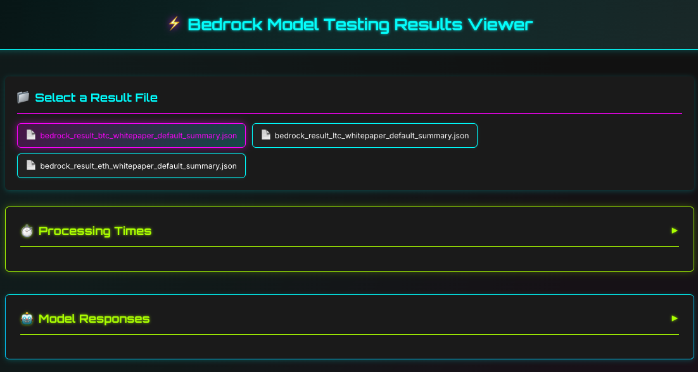
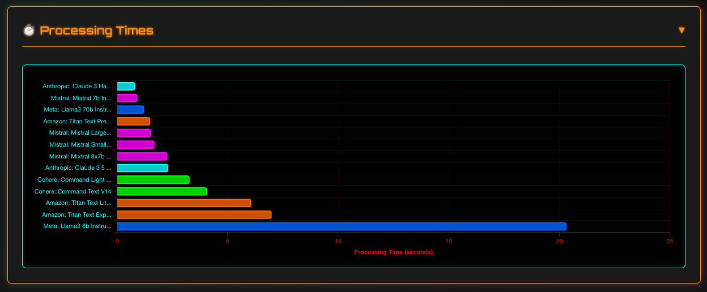
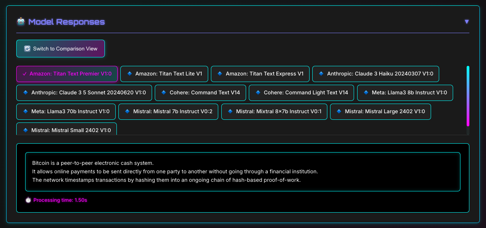

# Bedrock Model Evaluator

**Live Demo: https://bedrock.goth.capital/**

<div align="center">


</div>

A comprehensive tool for evaluating and comparing AWS Bedrock models using standardized prompts and input files.

## Overview

This project provides a framework for testing multiple AWS Bedrock foundation models against the same input data and prompts. It allows you to:

- Test multiple Bedrock models with the same input text
- Use different prompt templates for different use cases
- Compare model responses side-by-side
- Track performance metrics like processing time
- Visualize results through a simple web interface

## Features

- **Multi-model testing**: Test multiple AWS Bedrock models in parallel or individually
- **Customizable prompts**: Define different prompt templates for various use cases
- **Standardized evaluation**: Compare model outputs using the same input data
- **Performance tracking**: Measure and compare response times
- **Web-based viewer**: Visualize and compare results through a simple HTTP server
- **Configurable parameters**: Easily adjust model parameters like temperature and max tokens

## Documentation

The `DOCS` directory contains reference information about AWS Bedrock models:

- **Model Reference**: Contains data collected from the `us-east-1` region
  - `bedrock_available_models.json`: Complete list of active text models available in Bedrock
  - `bedrock_pricing_reference.html`: Current pricing information for input and output tokens

> **Note**: All model information and pricing data in the documentation was collected from the `us-east-1` AWS region and may vary in other regions.

## Example Files

The repository comes with pre-populated example files to help you get started:

- **source-files/**: Contains sample text files that can be used as input for model testing
  - These are provided as examples and can be replaced with your own content
  - Any text file placed in this directory will be available for testing

- **outputs-summary/**: Contains example output files showing test results
  - These demonstrate the format of the results generated by the tool
  - You can safely remove these files as new results will be generated when you run tests

These example files are intended to demonstrate how the tool works and can be removed or replaced with your own content as needed.

## Prerequisites

- Python 3.8+
- AWS account with access to Amazon Bedrock
- AWS CLI configured with appropriate permissions
- Boto3 library installed

## Installation

1. Clone this repository:
   ```bash
   git clone https://github.com/yourusername/bedrock-model-evaluator.git
   cd bedrock-model-evaluator
   ```

2. Install required dependencies:
   ```bash
   pip install -r requirements.txt
   ```

3. Configure your AWS credentials:
   ```bash
   aws configure
   ```

## Configuration

Edit the `config.py` file to customize your testing environment:

- `source_dir`: Directory containing input text files
- `output_dir`: Directory where results will be saved
- `default_model_id`: Default model to use if none specified
- `aws_region`: AWS region where Bedrock is available
- `model_ids`: List of Bedrock models to test
- `max_tokens`, `temperature`, `top_p`: Model parameters

## Usage

### Running Tests

To test with the default model:
```bash
python bedrock_tester.py
```

To test with a specific model:
```bash
python bedrock_tester.py --model anthropic.claude-3-haiku-20240307-v1:0
```

To test with all configured models:
```bash
python bedrock_tester.py --all
```

### Viewing Results

Start the web viewer:
```bash
python viewer.py
```

Then open your browser and navigate to `http://localhost:8000` to view and compare results.

## Project Structure

- `bedrock_tester.py`: Main script for testing models
- `config.py`: Configuration settings
- `prompts.py`: Prompt templates
- `viewer.py`: Web server for viewing results
- `viewer.html`: HTML interface for comparing results
- `source-files/`: Directory for input text files
- `outputs-summary/`: Directory for test results
- `DOCS/`: Reference documentation and model information
  - `Model Reference/`: Information about available models and pricing
  - `Screenshots/`: Original screenshot files

## Screenshots

*Main dashboard showing file selection and overview*


*Comparison of processing times across different models*


*Side-by-side comparison of model responses*



## License

This project is licensed under the terms included in the LICENSE file.
